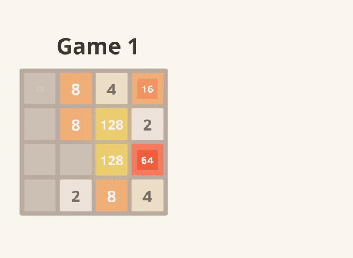

# Reinforcement Learning for 2048
A python clone of 2048, along with various custom **Numpy-only** reinforcement learning agents to play the game.

In reinforcement learning terms, 2048 is an episodic game with dense rewards, in which the actions are swiping up, down, left, and right, the states are the boards right after the swipe, and the afterstates are the board after a new tile spawns in.

## Best Results Achieved

*All 2048 results have non-regularized and non-discounted rewards. 

| Agent Type | Function Approx | Lr | Trained Games| Avg Score (1000 games) | Best Score (1000) games | Win% |
|-|-|-|-|-|-|-|
| TD(0) Afterstate | N-Tuple (TupleMap0) | 0.01 | 0 | 0 | 0 | 0 |

## Resources:
The various resources used for this project and how they were used are listed below. 
- [Temporal Difference Learning of N-Tuple Networks for the Game 2048](https://www.cs.put.poznan.pl/wjaskowski/pub/papers/Szubert2014_2048.pdf) for a 
- [Python implementation of above paper](https://github.com/alanhyue/RL-2048-with-n-tuple-network) for sanity checks.
- [On Reinforcement Learning for the Game of 2048](https://arxiv.org/pdf/2212.11087) for an overview of RL techniques used to play 2048. 
- [Reinforcement Learning: An Introduction](http://incompleteideas.net/book/the-book.html) by Sutton and Barto, for a comprehensive introdution to the field. 
- [The original 2048 repository](https://github.com/gabrielecirulli/2048) for the visualization and the original popularization of the game. 
- [The macht repository](https://github.com/rolfmorel/macht) for testing agents before I implemented the clone.

## Project TODOs
- Figure how to get longer training runs working on my machine, [this](https://medium.com/thefloatingpoint/running-really-long-scripts-ea929b943dd8) will likely help
- Implement and test [expectimax](https://en.wikipedia.org/wiki/Expectiminimax) n-ply search, currently doing just greedy/1-ply 
- Saved models directory with version number and hyperparams recording, add this to gitignore, this requires more though and organization
- ANN/CNN implementation to try out DeepRL, [this](https://www.jstage.jst.go.jp/article/ipsjjip/29/0/29_336/_pdf/-char/en) paper will help
- What exactly is the difference between model-free and model-based??
- RL Scaling laws??
- [This](https://2048verse.com/) is site for best players, 1M+ games.

## Structure of Repo
- The `game` directory stores the `gameof2048.py` file that implements the python clone of the game. To play the game, simply run `python3 play.py`
- The `agents` directory stores custom agent implementations in their own directories, and are partially composed of classes from the `models` and `functions` directories.
- The `2048` directory hosts modifications to the original 2048 repo to create the data viz at the top of this README. 
- `*-experiemnts.py` creates, trains, and saves a given agent
- `benchmark.py` benchmarks a given agent on a given number of games

## TODO Evolutionary Computation

- Use [PyTorch NEAT](https://github.com/ddehueck/pytorch-neat) to run new experiments
